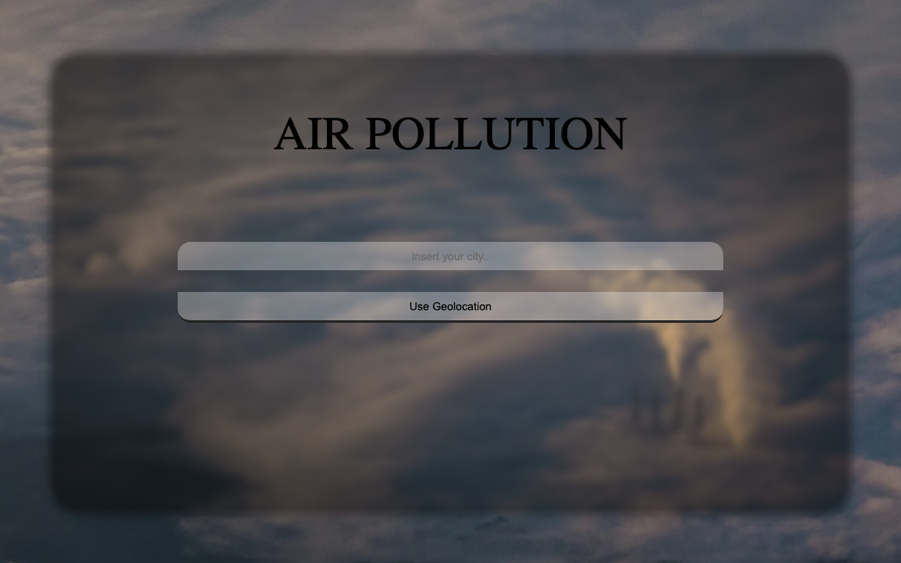

# Start2Impact JavaScritp Advanced Project

> This is the repo of my JSA Project for start2impact
---

### Table of Contents

- [Description](#description)
- [How To Use](#how-to-use)
- [References](#references)
- [License](#license)
- [About Me](#about-me)

---

## Description

The request were simple: create a web app using APIs to get cities pollution index, searching cities from a search bar or using geolocation to get data from your nearest city.

#### Technologies

- [JavaScript](https://javascript.info)
- [Webpack](https://webpack.js.org)
- [Air Quality Open Data Platform](https://aqicn.org/data-platform/token/#/)

[Back To The Top](#read-me-template)

---

## How To Use

#### Installation

Just download this repo locally, install the repo with

```javascript
	npm install
```

build the repo with 

```javascript
	npm run build
```

and start the app with

```javascript
	npm start
```
#### API .env

You need to add your APIs token to .env file, here's a snippet with .env sample:

```html
    API_KEY=yourtokenfromaqicn
```
[Back To The Top](#read-me-template)

---

## References




---

## About Me

- Instagram - [@pablomicheletti](https://www.instagram.com/pablomicheletti/)
- Website - [PabloMicheletti](http://pablomicheletti.it)

[Back To The Top](#read-me-template)